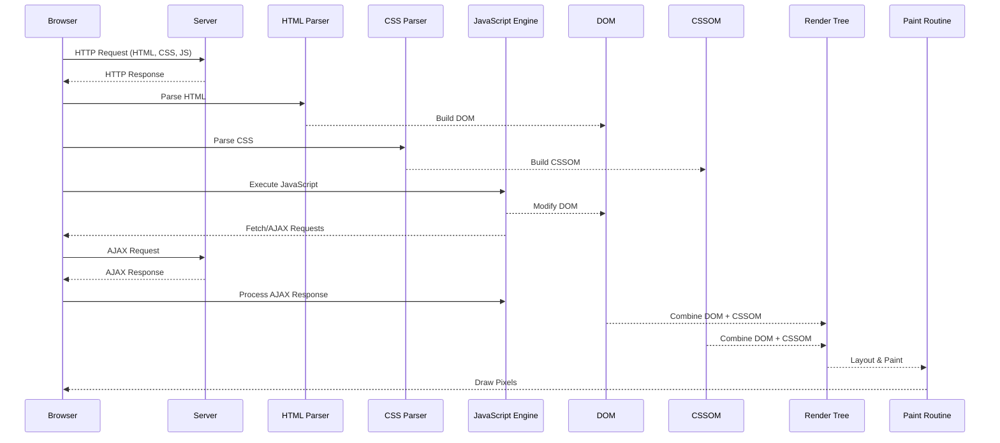

# Single Page Applications mit Angular

## Vom CERN zur SPA

Die Entwicklung von Single Page Applications (SPAs) ist eng mit der Geschichte des Webs selbst verbunden. Die allerersten Websites entstanden Anfang der 1990er-Jahre am CERN, wo Tim Berners-Lee das World Wide Web erfand. Diese Seiten waren rein statisch: einfache HTML-Dokumente, die auf Servern abgelegt und von Browsern geladen wurden. Jede Benutzerinteraktion erforderte ein vollständiges Neuladen der Seite, was den Funktionsumfang und die Benutzererfahrung stark einschränkte.

Mit dem Aufkommen des Internets als Massenmedium in den späten 1990er- und frühen 2000er-Jahren stiegen die Anforderungen rasant. Nutzer erwarteten dynamischere Inhalte, interaktive Oberflächen und Anwendungen, die eher Desktop-Software ähnelten. Ein entscheidender Meilenstein war die Einführung von JavaScript (1995), das es ermöglichte, Inhalte im Browser *dynamisch* zu verändern, ohne die Seite neu zu laden.

Ein weiterer wichtiger Fortschritt war die Entwicklung von *XMLHttpRequest* (um 1999), das den Grundstein für *AJAX* (Asynchronous JavaScript and XML) legte. AJAX erlaubte es erstmals, asynchrone Daten vom Server zu laden, wodurch Webanwendungen reaktiver und nutzerfreundlicher wurden. Google Maps (2005) und Gmail (2004) sind berühmte Beispiele für den erfolgreichen Einsatz dieser Technologie und gelten als Wegbereiter moderner SPAs.

Die zunehmende Komplexität solcher Anwendungen machte Frameworks notwendig. Mit *AngularJS* (2010), dem ersten populären SPA-Framework, begann eine neue Ära. Es folgten React (2013) und Vue (2014), die weitere Innovationen wie *komponentenbasierte Architektur* und *Virtual DOM* einführten. Heute sind SPAs ein Standard für viele Webanwendungen, getrieben von den gestiegenen Anforderungen an Performance, Usability und Sicherheit. Diese Entwicklung war nur möglich durch die Kombination aus technischen Fortschritten und den wachsenden Erwartungen der Nutzer an das Web.

> Eine Single Page Application (SPA) ist eine Webanwendung, die nur eine HTML-Seite lädt und Inhalte dynamisch nachlädt, sodass der Browser nie die komplette Seite neu laden muss.

## Dynamisches Laden
Inhalte dynamisch zu verändern und zu laden bedeutet, dass Teile einer Website aktualisiert werden können, ohne dass die gesamte Seite neu geladen werden muss. In klassischen Websites (Multi Page Applications, MPA) führt z. B. ein Klick auf einen Link dazu, dass der Browser eine neue HTML-Seite vom Server anfordert und die komplette Seite neu rendert. Das unterbricht den Workflow und wirkt oft langsamer.

Bei dynamischen Webanwendungen (z. B. SPAs) hingegen wird ein Großteil des Codes (HTML-Template, CSS, JavaScript) einmalig geladen. Danach übernimmt JavaScript im Browser die Steuerung. Inhalte können dann gezielt nachgeladen oder verändert werden – ohne komplettes Neuladen der Seite.

Beispiele für dynamische Veränderungen:
- Das Einfügen neuer Elemente ins DOM (z. B. ein neues Listenelement in eine To-Do-Liste).
- Das Aktualisieren von Text, Zahlen oder Bildern basierend auf Nutzereingaben oder Serverantworten.
- Das Nachladen von Daten via API (z. B. neue Nachrichten in einem Chat), während der Rest der Seite bestehen bleibt.

Dies verbessert:
* die Geschwindigkeit (da weniger Daten übertragen werden müssen)  
* die Nutzererfahrung (keine sichtbaren Ladeunterbrechungen)  
* die Möglichkeiten für interaktive, responsive Oberflächen  

Technisch wird dies durch:
- **DOM-Manipulation** über JavaScript
- **AJAX/Fetch** für Serverkommunikation
- **Frameworks** wie Angular, React oder Vue, die das strukturieren und erleichtern

Dynamisch Inhalte zu verändern heißt, dem Browser zu ermöglichen, Teile der Seite "on the fly" zu ändern, anstatt den Umweg über den Server zu gehen und eine neue Seite komplett zu laden.

## Vom Request zum Paint
Wenn eine Webanwendung in den Browser geladen wird, schickt der Browser eine **Request** an den Server und erhält eine **Response** mit HTML, CSS und JavaScript. Der Browser parst das HTML und erzeugt das **Document Object Model (DOM)**, eine baumartige Repräsentation aller Elemente. Parallel lädt die **JavaScript-Engine** die Skripte und führt sie aus – sie kann das DOM verändern (z. B. neue Elemente einfügen) und weitere asynchrone Requests starten (AJAX/Fetch). Gleichzeitig wertet der CSS-Parser die Stylesheets aus und berechnet für jedes DOM-Element die endgültigen Stile. Sobald DOM und CSSOM (CSS Object Model) vorliegen, kombiniert der Browser diese in der **Render Tree**, um zu wissen, was angezeigt werden soll. Schließlich übernimmt die **Paint-Routine** des Browsers die Aufgabe, Pixel auf dem Bildschirm zu zeichnen: Layout-Berechnungen bestimmen Position und Größe, und die Paint-Phase malt Farben, Schriften und Grafiken. Änderungen am DOM oder CSS lösen bei Bedarf effizientes Re-Painting oder Re-Layouting aus, sodass nur die betroffenen Bereiche neu gezeichnet werden.  



Wenn in einer Single Page Application Objekte dynamisch nachgeladen werden, läuft typischerweise folgender Ablauf ab:

1. **JS-Trigger statt automatischer Erkennung**  
   - Statt eines Browser-Events sorgt JavaScript (z. B. ein `setInterval`-Timer oder ein eigenes Signal) dafür, dass in regelmäßigen Abständen oder nach bestimmten Bedingungen eine Nachlade-Aktion gestartet wird.

2. **Event-Handler und Click-Interception**  
   - Normale Klicks auf Links oder Buttons würden den Browser standardmäßig auf eine neue URL leiten oder ein Formular absenden.  
   - JavaScript kann das verhindern, indem man im Event-Handler `event.preventDefault()` aufruft und so die Standardaktion des Browsers unterbindet.

3. **Asynchrone Request-Absendung**  
   - Im Handler (Timer-Callback oder Klick-Handler) wird dann über `fetch()` oder `XMLHttpRequest` eine asynchrone HTTP-Anfrage an den Server geschickt, um neue Daten (z. B. JSON-Objekte) zu erhalten.

4. **Response-Verarbeitung in der JS-Engine**  
   - Die JavaScript-Engine parst die Server-Antwort und wandelt sie in native JS-Objekte oder Arrays um.

5. **Gezielte DOM-Manipulation**  
   - Anhand der erhaltenen Daten erstellt ein Skript neue DOM-Knoten (z. B. `<div>`, `<li>`) oder ändert Attribute/Text bestehender Knoten via Methoden wie `document.createElement()`, `element.appendChild()` oder `element.textContent = ...`.

6. **Selektives Render-Update**  
   - CSS-Regeln bleiben erhalten; der Browser markiert nur die veränderten DOM-Zweige für ein Reflow/Repaint.  
   - So wird nur der neu eingefügte oder aktualisierte Bereich neu berechnet und gezeichnet, was eine flüssige Nutzererfahrung ermöglicht.

7. **Event-Listener für neue Elemente**  
   - Nach dem Einfügen registriert das Skript notwendige Event-Listener auf den neuen Elementen (z. B. Klick-Handler), sodass Interaktionen weiterhin funktionieren.

**Beispiel (Click-Intercept & Fetch):**  
```js
document.getElementById('loadMoreBtn').addEventListener('click', event => {
  event.preventDefault();                           // Browser-Default stoppen
  fetch('/api/items?page=2')                        // Asynchronen Request senden
    .then(res => res.json())
    .then(data => {
      const list = document.getElementById('itemList');
      data.items.forEach(item => {
        const li = document.createElement('li');
        li.textContent = item.name;
        list.appendChild(li);                       // DOM dynamisch erweitern
      });
    })
    .catch(console.error);
});
```


### `event.preventDefault()`

In klassischen Multi-Page-Applications übernimmt der Browser automatisch das Laden neuer Seiten oder das Absenden von Formularen, sobald ein Benutzer auf einen Link klickt oder einen Submit-Button drückt. Genau hier greift SPAs an:

1. **Entzug der Browser-Standardaktion**  
Durch Aufruf von `event.preventDefault()` im Event-Handler wird die üblich vom Browser ausgeführte Aktion unterbunden.  
```js
element.addEventListener('click', event => {
    event.preventDefault();
    // Keine Navigation oder Formular-Submit!
});
```

2. **Übernahme der Request-Verantwortung**
Anstelle des Browsers entscheidet nun der JavaScript-Code, **wann**, **wie** und **welche** HTTP-Requests ausgeführt werden.

* Mehrere Requests werden gleichzeitig oder sequentiell orchestrieren.
* js bestimmt das Datenformat (JSON, XML, Text) und kann Header, Query-Parameter etc. frei setzen.

3. **Custom Loading-Logik**
* **Debouncing** (z.B. in Suchfeldern)
* **Batching** oder **Throttling**
* **Fehler-Retry-Strategien**
* **Progress-Indicatoren** und Lade-Spinner
Können mit selbst geschriebenen Funktionen für `fetch()` oder `XMLHttpRequest` implementiert werden!

4. **Feingranulare UI-Updates**
Nach dem Empfang der Daten kann exakt gesteuert werden, welche Teile des DOMs aktualisiert werden:

```js
fetch('/api/data')
    .then(res => res.json())
    .then(payload => {
    // Nur betroffene Komponenten rerendern
    updateList(payload.items);
    });
```

5. **Vorteil für Performance & UX**

   * **Weniger Daten**: Nur Nutzdaten, kein komplettes HTML-Dokument
   * **Schnellere Reaktionen**: Kein vollständiger Seitenreload
   * **Nahtlose Interaktionen**: Animationen, Übergänge und State-Preservation

`preventDefault()` entzieht dem Browser die klassische Navigation und macht eine SPA vollständig selbstverantwortlich für das Anstoßen und Verarbeiten von HTTP-Requests. Das ist das Herzstück moderner Web-Apps und ermöglicht die hohe Interaktivität und Performance, die Nutzer heute erwarten.

### Virtual DOM
Der **virtuelle DOM** ist ein Abbild des echten DOM im Speicher des js-Codes, das Bibliotheken wie React verwenden, um UI-Updates effizienter zu gestalten:

1. **Repräsentation im Speicher**  
   - Beim Rendern erstellt das Framework nicht nur das echte DOM, sondern auch einen **virtuellen** Baum aus JavaScript-Objekten, der die Struktur und Eigenschaften der UI beschreibt.

2. **Änderungen im Virtual DOM**  
   - Wenn sich der Anwendungs-State ändert, wird ein **neuer** virtueller DOM-Baum erzeugt und mit dem **alten** Baum verglichen („Diffing“).  
   - Dieser Vergleich ermittelt genau, welche Knoten sich geändert haben.

3. **Minimaler DOM-Update**  
   - Anstatt das gesamte echte DOM neu zu rendern, wendet das Framework nur die **tatsächlichen** Unterschiede („Patches“) auf das echte DOM an.  
   - Dadurch werden teure Browser-Neuberechnungen und -Neuzeichnungen minimiert.

4. **Performance-Vorteil**  
   - Reduziert teure DOM-Operationen auf ein Minimum.  
   - Schnelleres Rendering, besonders bei komplexen oder häufig aktualisierten UIs.

5. **Beispielablauf**  
```js
// 1. Alter Virtueller DOM
const oldVDOM = createVDOM(state);
// 2. Neuer Virtueller DOM nach State-Update
const newVDOM = createVDOM(newState);
// 3. Differenz ermitteln
const patches = diff(oldVDOM, newVDOM);
// 4. Nur geänderte Teile im echten DOM anwenden
applyPatches(realDOMRoot, patches);
```

Der virtuelle DOM ist ein Abstraktionslayer, der UI-Änderungen zuerst in JavaScript-Objekten verarbeitet und dann nur die notwendigen Änderungen ins echte DOM überträgt. So bleibt die Anwendung performant und reaktiv.


## Unterschiedliche Frameworks
### Timeline wichtiger SPA-Frameworks

- **2010** – **AngularJS**: Erstes weit verbreitetes Framework von Google, nutzte zwei-Wege-Data-Binding und MVVM-Muster  
- **2013** – **Ember.js 1.0**: Konvention vor Konfiguration, Router-zentriert, „URL-First“ Ansatz  
- **2013** – **Backbone.js** (älter, aber populär ab 2013): Minimales MV*-Gerüst mit Models, Collections und Views  
- **2013** – **React**: Facebooks Bibliothek für komponentenbasiertes UI, führte virtuelles DOM ein  
- **2014** – **Vue.js**: Leichtgewichtig, inkrementell adoptierbar, kombiniert reaktives Data-Binding mit komponentenbasiertem Ansatz  
- **2016** – **Angular (2+)**: Komplett neu geschriebenes Framework, TypeScript-basiert, CLI, Modul-System, RxJS  
- **2017–2020** – **Svelte**: Compiler-basiert, verschiebt Arbeit vom Laufzeit-Framework in Build-Step  
- **2020+** – **Solid**, **Stencil**, **Alpine.js** u.a.: Fokus auf Performance, geringe Laufzeit, Web Components  

---

### Vergleich der Architektur-Ansätze

| Framework     | Architektur      | Data-Binding        | DOM-Handling            | CLI/Tooling        |
|---------------|------------------|---------------------|-------------------------|--------------------|
| AngularJS     | MVC/MVVM         | Zwei-Wege           | Direkt, Dirty Checking  | minimal, Grunt/Gulp|
| React         | Komponentendomäne| Ein-Wege            | Virtuelles DOM          | npx create-react-app |
| Vue.js        | MVVM-ähnlich     | Zwei-Wege + Ein-Wege| Virtuelles DOM          | vue-cli            |
| Angular 2+    | Komponenten-Modul| Ein-Wege (RxJS)     | Direkt + Zone.js        | angular cli        |
| Svelte        | Komponenten-Compiler | Reaktiv (Compiler) | Kein virtuelles DOM     | degit + Rollup/Vite|

---

### Vergleichstabelle (Eigenschaften)

| Eigenschaft       | AngularJS   | React            | Vue.js         | Angular 2+      | Svelte          |
|-------------------|-------------|------------------|----------------|-----------------|-----------------|
| Lernkurve         | Mittel      | Niedrig–Mittel   | Niedrig        | Mittel–Hoch     | Niedrig–Mittel  |
| Performance       | Gut         | Sehr gut         | Sehr gut       | Gut–Sehr gut    | Exzellent       |
| Bundle-Größe      | Groß        | Mittel           | Mittel         | Groß            | Klein           |
| Mobile-Support    | extern (Ionic) | React Native   | extern (Quasar)| Ionic/NativeScript | Svelte Native  |
| Community/Ökosystem | Groß      | Sehr groß        | Groß           | Groß            | Wachsende       |

---

### Warum Angular als erstes Framework?

- **Vollständiges Ökosystem**: Integrierter Router, HTTP-Client, Forms, Testing, CLI  
- **TypeScript-Basis**: Statische Typisierung hilft Einsteigern, Fehler früh zu erkennen  
- **Strikte Struktur**: Best Practices und Ordner-Konventionen machen Einstieg planbar  
- **Unterstützung durch Google**: Langlebigkeit und regelmäßige Releases  
- **Enterprise-Fokus**: Gut geeignet für größere Anwendungen und Teams  

---

### Neueste Technologien & Ausblick

- **Svelte** (2017+): Compiler-Ansatz eliminiert Laufzeit-Overhead, sehr kleine Bundles  
- **Solid** (2020): Reaktives Rendering mit feinkörnigem Updates, sehr hohe Performance  
- **Web Components** (Standards): Framework-unabhängige Custom Elements  
- **Kotlin/JS & Kotlin/Multiplatform**: Schreiben von SPAs in Kotlin, Interop mit React/Vue  
- **Flutter for Web**: UI in Dart, rendert in Canvas/HTML, mobil-first  
- **Blazor WebAssembly**: .NET-Code im Browser via WebAssembly  

**Vergleich**:  
- Compiler-Frameworks (Svelte, Solid) bieten beste Performance, erfordern aber neues Mindset.  
- Kotlin Multiplatform und Flutter verschieben Entwicklungssprachen, erfordern Brücken zu Web-Standards.  
- Angular, React und Vue bleiben Allrounder mit großer Community und vielen Bibliotheken.  


## Angular-Architektur & Kernkonzepte

> Eine in TypeScript geschriebene Angular-Anwendung wird vor der Ausführung von einem Transpiler in JavaScript umgewandelt, weil Browser nur JS verstehen und Angular so von modernen Sprachfeatures und strikter Typprüfung profitiert.

### Modularität mit NgModules und Standalone-Komponenten
- **NgModules** (z. B. `AppModule`, Feature-Module) bündeln weiterhin Komponenten, Services, Pipes und Direktiven sowie Routing-Konfiguration.
- **Standalone-Komponenten**, -Pipes und -Direktiven (seit Angular 14, weiter verfeinert in Angular 20) können ohne NgModule definiert werden:
```ts
@Component({
    standalone: true,
    selector: 'app-hello',
    template: `<h1>Hello World!</h1>`
})
export class HelloComponent {}
```

* Beide Ansätze lassen sich kombinieren: größere Applikationen nutzen Module + Lazy Loading, einzelne Komponenten bleiben standalone für maximale Flexibilität.

### Komponenten

* **Standards**: Template (HTML), Styles (CSS/SCSS), Klassenlogik (TypeScript)
* **Standalone**: Komponenten markieren mit `standalone: true`, können direkt in `bootstrapApplication()` oder als `imports` in anderen Komponenten verwendet werden.
* **Inputs/Outputs**: Kommunikation über `@Input()` und `@Output()` bleibt identisch.

### Services & DI

* **Services** deklarieren mit `@Injectable({ providedIn: 'root' })` oder in `providers` eines Moduls/Components.
* **Standalone Mode**: Auch ohne Module verfügbar, da DI über `bootstrapApplication()` initialisiert.
* **Tree-Shakable Providers**: Nur genutzte Services landen im Bundle.

### Observables & Reactive Programming

* Angular setzt auf **RxJS Observables** für asynchrone Datenströme und Ereignisverarbeitung.
* **HttpClient**-Methoden returnieren Observables, z. B. `this.http.get<T>(url): Observable<T>`.
* Komponenten abonnieren Daten per `subscribe()` oder verwenden die `async`-Pipe im Template:

```ts
// Service
getItems(): Observable<Item[]> {
return this.http.get<Item[]>('/api/items');
}

// Component
items$ = this.dataService.getItems();
```

```html
<ul>
<li *ngFor="let item of items$ | async">{{ item.name }}</li>
</ul>
```
* **Vorteil**: Reaktive Verarbeitung, einfache Fehlerbehandlung und Komposition mehrerer asynchroner Ströme.

### Routing & Lazy Loading

* **RouterModule** bleibt für modulbasiertes Routing (`RouterModule.forRoot()` / `forChild()`).
* **Standalone Routes**: Zuordnung von Routen zu standalone Komponenten möglich:

```ts
provideRouter([
{ path: '', component: HomeComponent },
{ path: 'admin', loadChildren: () => import('./admin/admin.module').then(m => m.AdminModule) }
])
```
* **Lazy Loading** von NgModules oder standalone Komponenten per `loadChildren` bzw. `loadComponent`.

### Pipes

* **Built-in**: `DatePipe`, `CurrencyPipe` etc.
* **Custom**: `@Pipe({ standalone: true, name: 'myPipe' })`
* Anwendung bleibt unverändert: `{{ value | myPipe }}`

## Vokabeltabelle

| Begriff      | Beschreibung                                                                         |
| ------------ | ------------------------------------------------------------------------------------ |
| NgModule     | Einheit aus Komponenten, Services und anderen Artefakten                             |
| Komponente   | UI-Baustein mit Template, Styles und Logik                                           |
| Service      | Wiederverwendbare Logik- oder Datenfunktion, bereitgestellt via Dependency Injection |
| Router       | Dienst zur Steuerung der Navigation anhand von URL-Änderungen                        |
| Lazy Loading | Technik, Feature-Module nur bei Bedarf nachzuladen                                   |
| Pipe         | Datenumwandlung im Template (z.B. Formatierung)                                      |


### State Management & Flux Pattern in Angular mit NgRx Store

#### Flux Pattern – Unidirektionaler Datenfluss  
1. **Action**  
   - Beschreibt eine Absicht, den State zu ändern (z. B. `increment`, `addTodo`).  
2. **Dispatcher / Store**  
   - Nimmt Actions entgegen und leitet sie an die Reducer weiter.  
3. **Reducer**  
   - Reine Funktion, die anhand der Action den neuen State erzeugt.  
```ts
on(increment, state => ({ ...state, counter: state.counter + 1 }))
```

4. **New State**
* Der Store speichert den aktualisierten State und benachrichtigt alle Subscriber.

5. **View**
* Komponenten abonnieren Teile des State und rendern die UI entsprechend.

#### NgRx Store – Angular-Implementierung des Flux-Prinzips

* **StoreModule.forRoot(reducers)** richtet den zentralen Store ein.
* **Actions** werden via `store.dispatch(action)` ausgelöst.
* **Reducers** (z. B. `counterReducer`, `todosReducer`) definieren, wie der State auf Actions reagiert.
* **Selectors** abstrahieren das Lesen von State-Teilen:

```ts
const selectCounter = (state: AppState) => state.counter;
this.counter$ = this.store.select(selectCounter);
```

#### Vorteile

* **Vorhersagbarkeit**: State-Änderungen sind nachvollziehbar und testbar.
* **Zentralisierung**: Ein einziger Store für globalen State, leichter Debugging (DevTools).
* **Skalierbarkeit**: Klare Trennung von UI-Logik und State-Logik.

#### Kurzes Beispiel

```ts
// Action
export const increment = createAction('[Counter] Increment');

// Reducer
const initialState = { counter: 0 };
export const counterReducer = createReducer(
  initialState,
  on(increment, state => ({ counter: state.counter + 1 }))
);

// Dispatch in Component
this.store.dispatch(increment());

// Select in Component
this.counter$ = this.store.select(state => state.counter);
```

## Anforderungen an sichere SPAs

### Externe IAM (Identity and Access Management)
- **Keycloak** übernimmt zentrale Aufgaben:
  - User-Verwaltung (Registrierung, Profile, Passwörter)  
  - Rollen- und Rechte-Management  
  - Single Sign-On (SSO) und Federation (z.B. LDAP, Social Login)  
- Die Anwendung delegiert Authentifizierung und Autorisierung an Keycloak, statt selbst komplexe Sicherheitslogik zu implementieren.

### HTTPS – Sicherer Transport
- **TLS/SSL** schützt alle Daten im Transit zwischen Browser, Angular-Frontend und Keycloak-Server.  
- **Force HTTPS** im Webserver und in Angular-Umgebungs-Configs, um Man-in-the-Middle-Angriffe zu verhindern.

> Komplett vom Browser gehandelt, da js nie selbst lädt, sondern immer das Laden an den Browser deligiert. Browser ist das Betriebssystem für js!

### CORS (Cross-Origin Resource Sharing)
- Browser sperren standardmäßig Anfragen an andere Domains.  
- Keycloak und API müssen **CORS-Header** setzen, z.B.  
```http
Access-Control-Allow-Origin: https://app.example.com  
Access-Control-Allow-Methods: GET, POST, PUT, DELETE  
Access-Control-Allow-Headers: Authorization, Content-Type  
```

* In Angular: `HttpClient` sendet automatisch Credentials oder Tokens, wenn `withCredentials: true` gesetzt ist.

### Token-basiertes Authentifizierungs-Flow

1. **Login**
* Angular leitet den Nutzer zur Keycloak-Login-Seite um (`redirect`).

2. **Token-Ausstellung**
* Nach erfolgreichem Login liefert Keycloak ein **JWT Access Token** (+ Optional Refresh Token) an den Browser.
> JWTs sind kompakte, signierte JSON-Token (Header + Payload + Signature), die in SPAs für zustandslose Authentifizierung und Autorisierung verwendet werden, da sie alle notwendigen Informationen enthalten und der Server keine Sessions speichern muss.

3. **Request mit Token**
* Jede API-Anfrage enthält im Header:
```http
Authorization: Bearer <access_token>
```
4. **Token-Handling**

* **Access Token** ist kurzlebig (z.B. 5–15 Minuten).
* **Refresh Token** wird genutzt, um ein neues Access Token zu holen, ohne erneuten Login.
* In Angular: `Keycloak-js`-Adapter oder `OIDC`-Libraries automatisieren Refresh und Token-Injektion.

### Zusammenfassung

* Externe IAM wie Keycloak entlasten das Frontend und API von Sicherheits- und Nutzerverwaltungsaufgaben.
* HTTPS gewährleistet Vertraulichkeit und Integrität.
* CORS-Header erlauben sichere Cross-Origin-Kommunikation.
* JWT-basierte Tokens (Access + Refresh) ermöglichen zustandslose, skalierbare Authentifizierung in SPAs.


## Live Demo
Tabea Röthemeyer (@tabeatheunicorn) zeigt uns im Live Coding das Entstehen einer Angular-App.